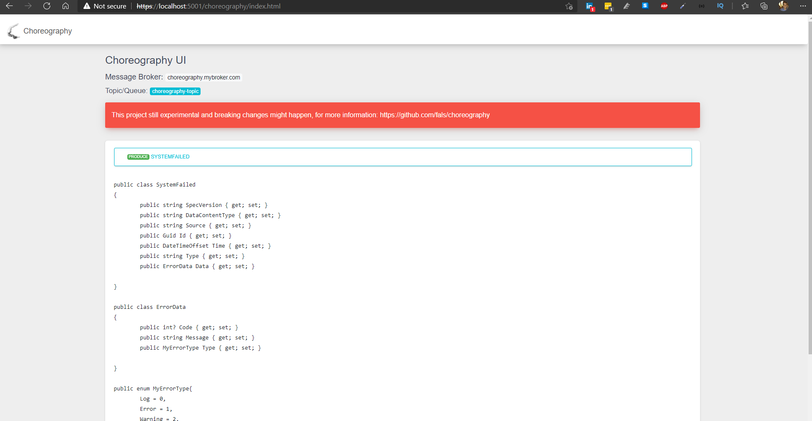

# Choreography-UI
 Choreography is an attempt to document events from a specific Microservice. In the modern world, with Event Driven Architectures becoming the norm, document events and providing [Discoverability](https://en.wikipedia.org/wiki/Discoverability) for those events is challenging.

## What is Choreography-UI then?

I picture it as a Swagger-UI for events in your Microservice. It allows you to add automatic documentation and provide discoverability for those events that service produces, and where those events go.

## Who is Choreography-UI meant for?
If you use Asp.NET Core applications, using strongly typed events this is ideal for your.

## How do I setup it

### Install Nuget latest version

https://www.nuget.org/packages/Choreography.AspNetCore.UI

### Configure Service

Add to your `Startup.cs` file to `ConfigureServices` method the Descriptor. The descriptor reads all non-abstract classes that are assignable from the specified type. **Make sure those classes have a default constructor**.

```csharp
public void ConfigureServices(IServiceCollection services)
{

    services.AddControllers();
    services.AddChoreographyDescriptor<IEvent>();
}
```

### Configure UI

Add to your `Startup.cs` file to `Configure` the UI configuration.

```csharp
public void Configure(IApplicationBuilder app, IWebHostEnvironment env)
{
    // ... other app config
    app.UseChoreographyUI(options =>
    {
        options.HeadContent = "Choreography UI";
        options.MessageBroker = "choreography.mybroker.com";
        options.TopicName = "choreography-topic";
        options.DocumentTitle = "Choreography";
    });
}

```

As you can see, you can display custom information to customize your page, also output the Broker and Topic/Queue your Microservice produces events to. 

### Hit the UI

After starting your service, just go to the URL to see the UI:

```
https://{SERVICE_URL}/choreography/index.html
```

You shall see the UI like below.




## Limitations

- UI still need some usability love

## Expected Roadmap

This project still experimental, I want community feedback, but here it goes what I'm planning to do:

Status | Version | Feature
--- | --- | ---
✅ | *alpha* | Gather community feedback about the idea
✅ | *beta* | Based on community feedback and known limitations fix issues
✅ | *1.0.0* | Display the event as C# class
➖ | *1.1.0* | Copy buttom for event
➖ | *1.2.0* | C# Symtax Hightlight
➖ | *1.3.0* | Distinguish Consumed and Produced events
➖ | *1.4.0* | Provide a JSON endpoint for the Schema
➖ | *1.5.0* | Include XML Comments in the event type descriptor
➖ | *1.5.0* | Improve Configuration with more extension options
➖ | *2.x.x* | CLI to generate typed code for consumers, probably a `dotnet tool`